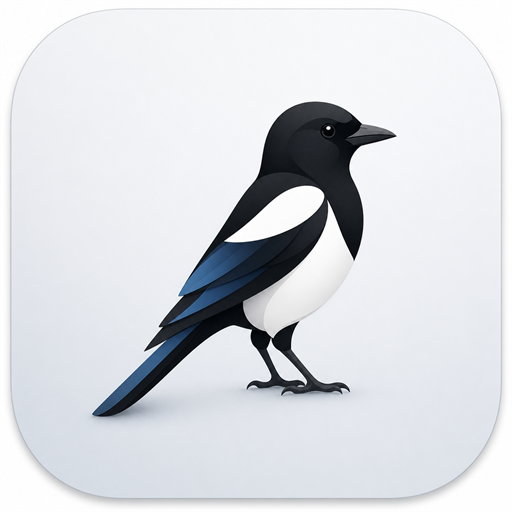

  
  <b>让碎片化信息轻松流转的剪贴板工具</b>

---

  

  ### **STAY FAST. STAY SYNCED.**

  | VERSION | LICENSE | PLATFORM |
  | :--- | :--- | :--- |
  |  |  |  |

  [English](./README.md) | [简体中文](./README.zh-CN.md)

---

## 关于本仓库

本仓库 fork 自 [`jimuzhe/tiez-clipboard`](https://github.com/jimuzhe/tiez-clipboard)，依据 GPL-3.0 协议进行二次分发，包含若干来自社区 PR 的修复合入，详见 [CHANGELOG](./CHANGELOG.md)。

---

## 主题展示

  <table>
    <tr>
      <td align="center"><b>极简毛玻璃</b> </td>
      <td align="center"><b>笔记本风格</b> </td>
      <td align="center"><b>便利贴风格</b> </td>
      <td align="center"><b>3D 动感</b> </td>
    </tr>
  </table>

---

## 为什么选择 TieZ?

| 极速性能 | 深度工作流 | 本地隐私 | 云端流畅 |
| :--- | :--- | :--- | :--- |
| **瞬间响应** Rust 核心层与原生监听器，只为追求毫秒级响应。 | **全能管理** 支持富文本、多色标签及高效的 AI 协作。 | **本地安全** 数据完全本地化存储，支持对各类敏感信息的预览自动脱敏。 | **多端无感同步** 基于 WebDAV 和 MQTT 协议，让剪贴板在设备间流动。 |

---

## 核心功能

### 基础体验
- **原生效率**：基于 Tauri 2 和 Rust 构建，极致的内存占用与流畅度。
- **智能采集**：自动记录文字、富文本 (HTML)、图片、文件和目录路径。
- **现代美学**：完美支持 云母/亚克力 背景效果及暗黑模式，内置经过精心调优的多款主题。
- **贴边收纳**：支持自动停靠在屏幕边缘，节省桌面空间且随时呼出。

### 管理与增强
- **标签系统**：通过自定义的多色标签对记录进行分类和整理。
- **表情管理**：内置完整的 Emoji 表情库，支持快捷搜索与输入。
- **高级设置**：精细化控制清理规则、全局快捷键映射及各种核心逻辑。
- **隐私脱敏**：智能识别身份证、手机号、邮箱等隐私信息，预览时自动脱敏。

### 网络与传输
- **WebDAV 同步**：数据由你掌控，实现完美的跨设备历史同步。
- **局域网传输**：在局域网内无缝且极速地传输文件和内容。
- **秒传验证码**：手机端收到的短信验证码，瞬间同步至你正在操作的设备。
- **MQTT 协议**：基于极轻量协议的同步方案，确保不同网络环境下的高实时性。

### 效率提速
- **外部协作**：一键调用外部编辑器修改内容，存盘后自动写回记录。
- **全局搜索**：支持按内容、所属应用、标签或日期进行全文检索。
- **顺序粘贴**：为高频办公场景设计的顺序拷贝/顺序粘贴工作流程。

---

## 系统要求

| 平台 | 运行环境要求 | 获取格式 |
| :--- | :--- | :--- |
| **Windows** | Windows 10/11 (x64) | `.exe` / `.msi` |

[**前往 Releases 下载最新版本 →**](https://github.com/Duojiyi/tiez-clipboard/releases)

---

## 开源协议

本项目基于 [GNU GPL-3.0](./LICENSE) 协议开源。

- 原始版权归 **jimuzhe/tiez-clipboard** 项目作者及全体贡献者所有。
- 本仓库为二次分发版本，依 GPL-3.0 第 5 条要求保留原始版权声明、协议文本及变更说明。
- 任何基于本仓库的再分发同样必须以 GPL-3.0 协议开源全部对应源码。
